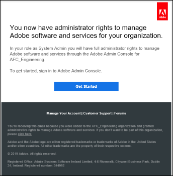

# Configurare il servizio di conversione automatica dei moduli (AFCS) {#about-this-help}

Questo articolo descrive come un amministratore di AEM può configurare il servizio AFCS (Automated Forms Conversion Service) per automatizzare la conversione del proprio PDF forms in Forms adattivo. Questo articolo è destinato agli amministratori IT e AEM della tua organizzazione. Le informazioni fornite si basano sul presupposto che chiunque legga questo articolo abbia familiarità con le seguenti tecnologie:

* Installazione, configurazione e amministrazione di pacchetti Adobe Experience Manager e AEM,

* Utilizzo di sistemi operativi Linux® e Microsoft® Windows®

<!--- >[!VIDEO](https://video.tv.adobe.com/v/29267/) 

**Watch the video or read the article to configure Automated Forms Conversion service (AFCS)** -->

## Onboarding{#onboarding}

Il servizio è disponibile gratuitamente per i clienti AEM 6.5 Forms On-Premise e per i clienti aziendali Adobe Managed Service. Per richiedere l’accesso al servizio, puoi contattare il team di vendita Adobe o il tuo rappresentante Adobe. Il servizio è disponibile anche gratuitamente e preabilitato per i clienti AEM Forms as a Cloud Service.

Adobe abilita l’accesso per la tua organizzazione e fornisce i privilegi richiesti alla persona designata come amministratore dell’organizzazione. L’amministratore può concedere agli sviluppatori di AEM Forms (utenti) dell’organizzazione l’accesso al servizio.

## Prerequisiti {#prerequisites}

Per utilizzare il servizio di conversione automatica dei moduli (AFCS, Automated Forms Conversion Service) è necessario quanto segue:

* Il servizio di conversione automatica dei moduli (AFCS) è abilitato per la tua organizzazione
* Un account Adobe ID con privilegi di amministratore per il servizio di conversione
* AEM 6.5 in esecuzione con il Service Pack di AEM o l’istanza Autore di AEM Forms as a Cloud Service più recente con gli aggiornamenti più recenti.
* Un utente AEM (nell’istanza AEM) che è membro del gruppo di utenti Forms

## Configurare l’ambiente {#setuptheservice}

Prima di utilizzare il servizio, prepara l’istanza di authoring di AEM per la connessione al servizio in esecuzione su Adobe Cloud. Per preparare l’istanza per il servizio, effettua le seguenti operazioni nella sequenza elencata:

1. [Scarica e installa AEM 6.5 o AEM Forms as a Cloud Service integrato](#aemquickstart)
1. [Scarica e installa il Service Pack più recente di AEM (solo per AEM 6.5)](#servicepack)
1. [Scarica e installa il pacchetto aggiuntivo AEM Forms più recente (solo per AEM 6.5)](#downloadaemformsaddon)
1. [Creare temi e modelli personalizzati](#referencepackage)

### 1. Scarica e installa AEM 6.5 o AEM Forms as a Cloud Service integrato {#aemquickstart}


Il servizio di conversione automatica dei moduli (AFCS) viene eseguito sull’istanza di authoring di AEM. Per configurare un’istanza di authoring AEM è necessario AEM 6.5 o AEM Forms as a Cloud Service.

* Se AEM 6.5 non è ancora operativo, scaricalo dalle seguenti posizioni. Dopo aver scaricato AEM, per istruzioni su come configurare un&#39;istanza di AEM Author, vedi [distribuzione e manutenzione](https://helpx.adobe.com/experience-manager/6-5/sites/deploying/using/deploy.html#defaultlocalinstall).:

   * Se sei già un cliente di AEM, scarica AEM 6.5 dal [sito Web Adobe Licensing](http://licensing.adobe.com).

   * Se sei un partner Adobe, utilizza il [Programma di formazione per i partner Adobe](https://adobe.allegiancetech.com/cgi-bin/qwebcorporate.dll?idx=82357Q) per richiedere AEM 6.5.

* Se utilizzi AEM Forms as a Cloud Service, consulta onboarding per [AEM Forms as a Cloud Service](https://experienceleague.adobe.com/docs/experience-manager-forms-cloud-service/forms/setup-environment/setup-forms-cloud-service.html?lang=en#setup-environment) e [configurare un ambiente di sviluppo locale](https://experienceleague.adobe.com/docs/experience-manager-forms-cloud-service/forms/setup-environment/setup-local-development-environment.html?lang=en#setup-environment).

### 2. Scarica e installa AEM l’ultimo Service Pack (solo per AEM 6.5) {#servicepack}

Scarica e installa il Service Pack più recente di AEM. Per istruzioni dettagliate, consulta [Note sulla versione di AEM 6.5 Service Pack](https://experienceleague.adobe.com/it/docs/experience-manager-65/content/release-notes/release-notes).

### 3. Scarica e installa il pacchetto del componente aggiuntivo AEM Forms (solo per AEM 6.5)   {#downloadaemformsaddon}

Un’istanza di AEM contiene funzionalità di base per i moduli. Il servizio di conversione richiede le funzionalità complete di AEM Forms. Scarica e installa il pacchetto del componente aggiuntivo AEM Forms per usufruire di tutte le funzionalità di AEM Forms. Il pacchetto è necessario per configurare ed eseguire il servizio di conversione. Per istruzioni dettagliate, vedere [Installare e configurare le funzionalità di acquisizione dati.](https://experienceleague.adobe.com/en/docs/experience-manager-65/content/forms/install-aem-forms/osgi-installation/installing-configuring-aem-forms-osgi)
https://adminconsole.adobe.com/
>[!NOTE]
> Dopo l’installazione del pacchetto aggiuntivo, assicurati di eseguire le configurazioni obbligatorie di post-installazione.
>

<!-- ### (Optional) Download and install connector package  {#installConnectorPackage}

The connector package provides early access to the [Auto-detect logical sections](convert-existing-forms-to-adaptive-forms.md#run-the-conversion) features and improvements delivered in release AFC-2020.03.1. Do not install the package if you do not require feature and improvements delivered in AFC-2020.03.1.  You can [download the connector package from AEM Package Share](https://www.adobeaemcloud.com/content/marketplace/marketplaceProxy.html?packagePath=/content/companies/public/adobe/packages/cq650/featurepack/AFCS-Connector-2020.03.1). -->


### 4. Creare temi e modelli personalizzati {#referencepackage}

I pacchetti di riferimento contengono temi e modelli di esempio. Il servizio di conversione automatica dei moduli (AFCS) richiede almeno un tema e un modello per convertire un modulo PDF in un modulo adattivo. Crea un tema e un modello personalizzato e punta alla [configurazione del servizio](#configure-the-cloud-service) per utilizzare modelli e temi personalizzati prima di utilizzare il servizio.

Puoi anche scaricare e installare il pacchetto [AEM Forms Reference Assets](https://experience.adobe.com/#/downloads/content/software-distribution/it/aemcloud.html) nell&#39;istanza Autore. Crea alcuni temi e modelli di riferimento.

## Configurare l’accesso e le autorizzazioni

Prima di procedere alla configurazione del servizio e connettere l’istanza al servizio in esecuzione su Adobe Cloud, scopri gli utenti tipo e i privilegi necessari per connettersi al servizio. Il servizio utilizza due diversi tipi di utenti tipo, amministratori e sviluppatori:

* **Amministratori**: gli amministratori sono responsabili della gestione del software e dei servizi Adobe per la propria organizzazione. Gli amministratori consentono agli sviluppatori della propria organizzazione di connettersi al servizio AFCS (Automated Forms Conversion Service) in esecuzione su Adobe Cloud. Quando viene eseguito il provisioning di un amministratore per un&#39;organizzazione, l&#39;amministratore riceve un messaggio e-mail con il titolo **[!UICONTROL 'You now have administrator rights to manage Adobe software and services for your organization']**. Se sei un amministratore, controlla la tua casella di posta elettronica con il titolo precedentemente menzionato e procedi a [concedere l&#39;accesso agli sviluppatori della tua organizzazione](#adduseranddevs).



* **Sviluppatori**: uno sviluppatore connette un&#39;istanza Autore AEM Forms al servizio di conversione automatica dei moduli (AFCS) in esecuzione su Adobe Cloud. Quando un amministratore concede a uno sviluppatore i diritti per connettersi al servizio di conversione automatica dei moduli (AFCS), allo sviluppatore viene inviata un’e-mail con il titolo Ora disponi dell’accesso per sviluppatori per gestire le integrazioni API di Adobe per la tua organizzazione. Se sei uno sviluppatore, controlla la tua casella di posta elettronica con il titolo menzionato in precedenza e procedi a [Connetti la tua istanza AEM locale al servizio di conversione automatica dei moduli su Adobe Cloud.](#connectafcadobeio)


### Concedere l’accesso agli sviluppatori dell’organizzazione

Dopo che Adobe abilita l’accesso per la tua organizzazione e fornisce i privilegi richiesti all’amministratore, quest’ultimo può accedere ad Admin Console (istruzioni dettagliate di seguito), creare un profilo e aggiungere sviluppatori al profilo. Gli sviluppatori possono collegare un’istanza di AEM Forms al servizio di conversione automatica dei moduli (AFCS) su Adobe Cloud.

Gli sviluppatori sono membri dell’organizzazione designati per eseguire il servizio di conversione. Solo gli sviluppatori che vengono aggiunti al profilo AFCS (Automated Forms Conversion Service) di Adobe possono utilizzare il servizio AFCS (Automated Forms Conversion Service).
Per creare un profilo e aggiungervi sviluppatori, effettua le seguenti operazioni. È necessario almeno un profilo per concedere l’accesso richiesto agli sviluppatori dell’organizzazione:

1. Accedi a [Admin Console](https://adminconsole.adobe.com/). Utilizza **Adobe ID** dell&#39;amministratore predisposto per l&#39;utilizzo del servizio di conversione automatica dei moduli (AFCS) per l&#39;accesso.
1. Fare clic sull&#39;opzione **[!UICONTROL Automated Forms Conversion]**.
1. Fare clic su **[!UICONTROL New Profile]** nella scheda **[!UICONTROL Products]**.
1. Specificare **[!UICONTROL Name]**, **[!UICONTROL Display Name]** e **[!UICONTROL Description]** per il profilo. Fai clic su **[!UICONTROL Done]**. Ad esempio, crea un profilo come **AFC_Flamingo_Test_Dev**.

   

1. Aggiungi uno sviluppatore al profilo. Per aggiungere gli sviluppatori:
   1. In [Admin Console](https://adminconsole.adobe.com/enterprise), passa alla scheda Panoramica.
   1. Fai clic su **[!UICONTROL Assign Developers]** sulla scheda prodotto richiesta.
   1. Immetti l’indirizzo e-mail degli sviluppatori e, facoltativamente, il nome e il cognome.
   1. Seleziona i profili di prodotto. Fare clic su **[!UICONTROL Save]**.

Ripeti i passaggi precedenti per tutti gli utenti. Per ulteriori dettagli sull&#39;aggiunta di sviluppatori, vedere [Gestione sviluppatori](https://helpx.adobe.com/enterprise/using/manage-developers.html).

Quando un amministratore aggiunge sviluppatori al profilo di Adobe I/O, gli sviluppatori ricevono una notifica tramite e-mail (se configurata).

<!--
### Configure email notification for local AEM Forms instance

Automated Forms Conversion service (AFCS) uses the Day CQ mail service to send email notifications. These email notifications contain information about successful or failed conversions. If you choose not receive notification, skip these steps. Perform the following steps to configure the Day CQ Mail Service:

* **For AEM 6.5 Forms**:

   1. Go to AEM configuration manager at `http://[server]:[port]/system/console/configMgr`
   2. Open the Day CQ Mail Service configuration. Specify a value for the **[!UICONTROL SMTP server host name]**, **[!UICONTROL SMTP server port]**, and **[!UICONTROL From address]** fields. Click **[!UICONTROL Save]**.

      You can contact your email service provider or IT administrator for information about host name and port of SMTP server. You can use any valid email address in the from field. For example, notification@example.com or donotreply@example.com.

   3. Open the **[!UICONTROL Day CQ Link Externalizer]** configuration. In the **[!UICONTROL Domains]** field, specify the actual host name or IP address and port number for local, author, and publish instances. Click **[!UICONTROL Save]**.

* For AEM Forms as a Cloud Service, [log a support ticket to enable the email service](https://experienceleague.adobe.com/docs/experience-manager-cloud-service/implementing/developing/development-guidelines.html?lang=en#sending-email). -->

### Aggiungi utente al gruppo forms-users {#adduserstousergroup}

Specifica un indirizzo e-mail nel profilo dell’utente di AEM designato per eseguire il servizio. Assicurati che l&#39;utente sia membro del gruppo **forms-users**. Le e-mail vengono inviate all’indirizzo e-mail dell’utente che esegue la conversione. Per specificare un indirizzo e-mail per l&#39;utente e aggiungere l&#39;utente al gruppo di utenti dei moduli:

1. Accedi all’istanza di authoring di AEM Forms come amministratore AEM. Utilizza le credenziali AEM locali per accedere.
1. Fare clic su **[!UICONTROL Adobe Experience Manager]** > **[!UICONTROL Tools]** > **[!UICONTROL Security]** > **[!UICONTROL Users]**.
1. Selezionare un utente designato per eseguire il servizio di conversione e fare clic su **[!UICONTROL Properties]**. Viene visualizzata la pagina **Modifica impostazioni utente**.
1. Specificare un indirizzo di posta elettronica nel campo **[!UICONTROL Email]** e fare clic su **[!UICONTROL Save]**. Le e-mail vengono inviate all’indirizzo e-mail specificato al completamento o al fallimento della conversione.

   
1. Fare clic sulla scheda **Gruppi**. Nella scheda Seleziona gruppo, digita e seleziona il gruppo **utenti-moduli**.
1. Fai clic su **Salva e chiudi**. L&#39;utente è ora membro del gruppo utenti di Forms.

   

## Connettere la tua istanza di AEM Forms al servizio di conversione automatica dei moduli (AFCS) su Adobe Cloud

Se un amministratore ti fornisce l’accesso come sviluppatore, puoi collegare la tua istanza di AEM Forms al servizio di conversione automatica dei moduli (AFCS) in esecuzione su Adobe Cloud.
Per connettere l’istanza di AEM Forms al servizio di conversione automatica dei moduli, effettua le seguenti operazioni:

[1. Configurare le API del servizio su Adobe Developer Console](#configure-the-service-apis-on-adobe-developer-console)

[2. Creare configurazioni Adobe IMS](#2-create-adobe-ims-configurations)

[3. Creare una configurazione di conversione moduli automatica](#3-create-automated-forms-conversion-configuration)

### 1. Configurare le API del servizio su Adobe Developer Console

Per utilizzare il servizio di conversione automatica dei moduli (AFCS), creare un progetto e aggiungere l&#39;API **Servizio di configurazione automatica di Forms** al progetto in Adobe Developer Console. L’integrazione genera la chiave API, il segreto client, l’ID account tecnico, gli ambiti e l’ID organizzazione.
Per configurare l’API del servizio di conversione automatica dei moduli su Adobe Developer Console, effettua le seguenti operazioni:

1. Accedi a https://developer.adobe.com/console . Per accedere, utilizza l’account Adobe ID per sviluppatori fornito dall’amministratore per accedere alla console Adobe I/O.
1. Seleziona la tua organizzazione dall’angolo in alto a destra. Se non sai qual è la tua organizzazione, contatta l’amministratore.
1. Fai clic su **[!UICONTROL Create new project]**. Viene visualizzata una schermata per iniziare a utilizzare il nuovo progetto.

   

1. Fai clic su **[!UICONTROL Add API]**. Viene visualizzata una schermata con l’elenco di tutte le API abilitate per l’account.
   

1. Selezionare **[!UICONTROL Automated Forms Conversion service]** e fare clic su **[!UICONTROL Next]**. Viene visualizzata una schermata per configurare l’API.
   

1. Selezionare il metodo di autenticazione da server a server **OAuth**.
1. Specificare **[!UICONTROL Credential Name]** e fare clic su **[!UICONTROL Next]**.
   
1. Seleziona un **profilo prodotto**. Ad esempio, seleziona un profilo come **AFC_Flamingo_Test_Dev**.
1. Fai clic su **[!UICONTROL Save configured API]**.
   

   >[!NOTE]
   >
   > Seleziona il profilo creato concedendo l’accesso agli sviluppatori dell’organizzazione. Se non conosci il profilo da selezionare, contatta l’amministratore.

1. Fare clic su **[!UICONTROL OAuth Server-to-Server]** per visualizzare la chiave API, il segreto client e altre informazioni necessarie per connettere l&#39;istanza AEM al servizio di conversione automatica dei moduli (AFCS).
   

   Le informazioni contenute nella pagina vengono utilizzate per creare la configurazione IMS, come spiegato nella sezione [Creare la configurazione tecnica IMS nell&#39;istanza Autore AEM](#2-create-ims-technical-configuration-on-aem-author-instance).

   

### 2. Creare configurazioni Adobe IMS

Accedi all’istanza di authoring per creare le configurazioni Adobe IMS. Utilizza **Dettagli credenziali OAuth** per recuperare la chiave API, il segreto client, l&#39;ID account tecnico, gli ambiti e l&#39;ID organizzazione.

1. Accedi all’istanza Autore di AEM Forms. Passa a **[!UICONTROL Tools]**> **[!UICONTROL Security]** > **[!UICONTROL Adobe IMS Configurations]**.
1. Fai clic su **[!UICONTROL Create]**.

   

1. Viene visualizzata la pagina **[!UICONTROL Adobe IMS Technical Account Configuration]**.

   
1. Seleziona **[!UICONTROL Automated Forms Conversion Service]** in **Soluzione cloud**.
1. Specifica quanto segue:

   * **Titolo**: specifica un titolo.
   * **Server autorizzazioni**: [https://ims-na1.adobelogin.com](https://ims-na1.adobelogin.com)
   * Recupera quanto segue dalla sezione [Configurare le API del servizio in Adobe Developer Console](#1-configure-the-service-apis-on-adobe-developer-console):
      * **ID client**: copia e incolla **Chiave API(ID client)**.
      * **Segreto client**: copia e incolla **Segreto client**.
      * **Ambito**: copia e incolla **Ambiti**.
      * **ID organizzazione**: copia e incolla **ID account tecnico**.

     

1. Fai clic su **[!UICONTROL Save]**. Viene creata la configurazione Adobe IMS.

   >[!CAUTION]
   >
   > Crea una sola configurazione IMS. Non creare più di una configurazione IMS.

1. Seleziona la **configurazione Adobe IMS** e fai clic su **[!UICONTROL Check Health]**. Viene visualizzata una finestra di dialogo.
   

   Viene visualizzata una finestra di dialogo **Controlla**.

1. Fai clic su **[!UICONTROL Check]**.

   

   Una volta stabilita la connessione, viene visualizzato il messaggio *Token recuperato correttamente*.

   

1. Fai clic su **Chiudi**.

### 3. Creare una configurazione di conversione moduli automatica

Crea una configurazione di conversione automatica dei moduli per connettere la tua istanza di AEM al servizio di conversione. Consente inoltre di specificare un modello, un tema e frammenti di modulo per una conversione. Puoi creare più configurazioni del servizio cloud separate per ciascun set di moduli.
Ad esempio, è possibile avere una configurazione separata per i moduli del reparto vendite e una distinta per i moduli dell&#39;assistenza clienti. Per creare una configurazione del servizio cloud, effettua le seguenti operazioni:

1. Nell&#39;istanza di AEM Forms, fare clic su **[!UICONTROL Adobe Experience Manager]** > **[!UICONTROL Tools]**> **[!UICONTROL Cloud Services]** > **[!UICONTROL Automate Forms Conversion Configuration]**.
1. Selezionare la cartella **[!UICONTROL Global]** e fare clic su **[!UICONTROL Create]**.
Viene visualizzata la pagina per **Creare la configurazione di conversione automatica dei moduli**. La configurazione viene creata nella cartella **Global**. Puoi anche creare la configurazione in un’altra cartella esistente o creare una cartella per le configurazioni.
   
1. Nella pagina **[!UICONTROL Create Automated Forms Conversion Configuration]**, specificare il valore per i campi seguenti e fare clic su **[!UICONTROL Next]**.

   

   | Campo | Descrizione |
   |--- |--- |
   | Titolo | Titolo univoco per la configurazione. Il titolo viene visualizzato nell’interfaccia utente utilizzata per avviare la conversione. |
   | Nome | Nome univoco per la configurazione. La configurazione viene salvata nel CRX-Repository con il nome specificato. Il nome può corrispondere al titolo. |
   | Posizione miniature | Posizione della miniatura per la configurazione. |
   | URL del servizio | URL del servizio di conversione automatica dei moduli (AFCS) su Adobe Cloud. Utilizza l&#39;URL `https://aemformsconversion.adobe.io/`. |
   | Modello | Modello predefinito da applicare ai moduli convertiti. Puoi sempre specificare un modello diverso prima di iniziare la conversione. Un modello contiene la struttura di base e il contenuto iniziale di un modulo adattivo. Puoi scegliere un modello tra quelli forniti come standard. Puoi anche creare un modello personalizzato. |
   | Tema | Tema predefinito da applicare ai moduli convertiti. Puoi sempre specificare un tema diverso prima di iniziare la conversione.  Puoi fare clic sull’icona per scegliere un tema fornito con il prodotto. Puoi anche creare un tema personalizzato. |
   | Frammenti esistenti | Posizione di eventuali frammenti esistenti. |
   | Metamodello personalizzato | Percorso del file .schema.json del metamodello personalizzato. Puoi creare metamodelli separati per le lingue inglese, francese, tedesco, spagnolo, italiano e portoghese. |

1. Nella scheda **[!UICONTROL Advanced]** della pagina **[!UICONTROL Create Automated Forms Conversion Configuration]**, specificare il valore per il campo seguente:
   

   <table>
   <thead>
   <tr>
   <th>Campo</th>
   <th>Descrizione</th>
   </tr>
   </thead>
   <tbody>
   <tr>
   <td >Genera documento di record</td>
   <td>Selezionare l'opzione per generare automaticamente il documento di record per i moduli convertiti. L’opzione è disponibile solo per i moduli basati su XFA (XDP e PDF forms). Se si abilita l'opzione, dopo aver inviato un modulo è possibile consentire ai clienti di conservare una registrazione, in formato cartaceo o in formato documento, delle informazioni che hanno compilato nel modulo per riferimento futuro. Tale documento è denominato documento di record.</td>
   </tr>
   <tr>
   <td>Abilita Analytics</td>
   <td>(Per AEM 6.5) Seleziona l’opzione per abilitare Adobe Analytics su tutti i moduli convertiti. Prima di utilizzare l’opzione, accertati che Adobe Analytics sia abilitato per la tua istanza di AEM Forms.</td>
   </tr>
   </tbody>
   </table>

   * Quando l’origine è un modulo basato su XFA con estensione .XDP, il DOR di output mantiene il layout XFA, altrimenti il servizio di conversione utilizza un modello preconfigurato per generare DOR per altri moduli basati su XFA.
   * Quando si invia un modulo XFA, i dati di invio del modulo vengono salvati come un elemento XML o un attributo. Ad esempio, `<Amount currency="USD"> 10.00 </Amount>`. La valuta viene salvata come attributo e come importo della valuta; 10.00 viene salvato come elemento. I dati di invio di un modulo adattivo non dispongono di attributi, ma solo di elementi. Pertanto, quando un modulo basato su XFA viene convertito in modulo adattivo, i dati di invio del modulo adattivo contengono un elemento per ciascun attributo di questo tipo. Ad esempio,

   ```css
      {
         "Type": "Principal",
   
         "Amount": "10.00",
   
         "currency": "USD"
      }
   ```

1. Fai clic su **[!UICONTROL Create]**. Viene creata la configurazione cloud. La tua istanza di AEM Forms è pronta per iniziare a convertire i moduli legacy in Forms adattivo.
