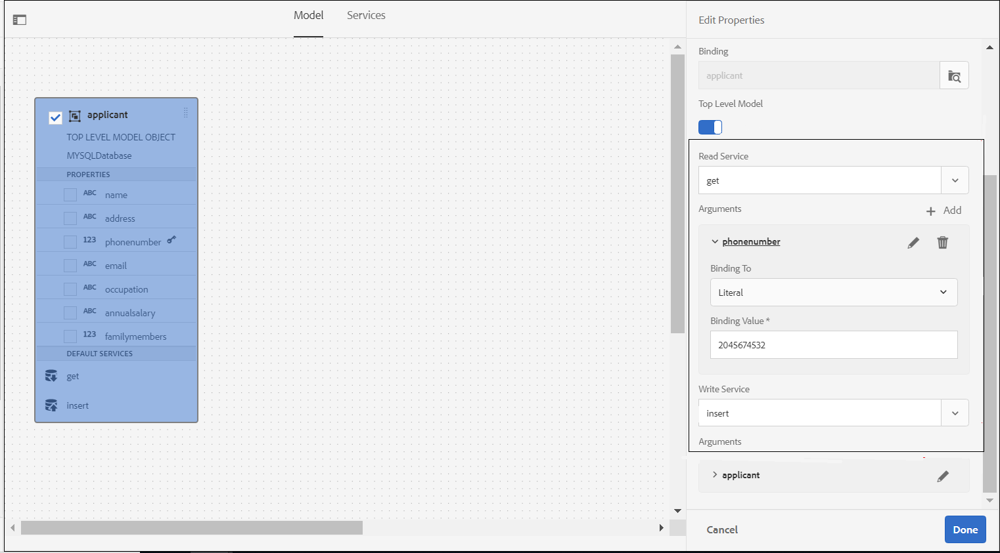

# Workflow di preriempimento basato su origine di dati e invio consigliati per i moduli adattivi {#recommended-data-source-btased-prefill-and-submit-workflows-for-adaptive-forms}

Con i moduli adattivi convertiti tramite il servizio di Automated forms conversion (AFCS) è possibile utilizzare una delle seguenti origini dati:

* Modello dati modulo, OData o qualsiasi altro servizio di terze parti
* Schema JSON
* Schema XSD

In base all’origine dati, puoi scegliere di generare un modulo adattivo con o senza un modello di dati.

Questo articolo descrive i flussi di lavoro consigliati per precompilare i valori dei campi e le opzioni di invio dopo aver selezionato un’origine dati e generato un modulo adattivo utilizzando il servizio di conversione.

<table> 
 <tbody> 
  <tr> 
   <th><strong>Origine dati</strong></th> 
   <th><strong>Workflow consigliato</strong></th> 
  </tr> 
  <tr> 
   <td><p>Modello dati modulo, OData o qualsiasi altro servizio di terze parti</p></td> 
   <td> 
    <p><strong>Opzione 1</strong>: è possibile selezionare come origine dati modello dati modulo, OData o qualsiasi altro servizio di terze parti. <a href="#generate-adaptive-forms-with-no-data-binding">generare un modulo adattivo senza associazione dati</a> utilizzando il servizio di Automated forms conversion (AFCS). I campi del modulo adattivo vengono associati manualmente alle entità del modello dati del modulo e per precompilare i valori dei campi viene utilizzata l’opzione Servizio di precompilazione modello dati modulo. Per inviare il modulo adattivo, utilizza l’opzione Invia utilizzando il modello dati del modulo.</p></td> 
  </tr>
  <tr> 
   <td></td> 
   <td> 
   <p><strong>Opzione 2</strong>: è possibile selezionare come origine dati modello dati modulo, OData o qualsiasi altro servizio di terze parti. <a href="#generate-adaptive-forms-with-no-data-binding">generare un modulo adattivo senza associazione dati</a> utilizzando il servizio di Automated forms conversion (AFCS). Per precompilare i valori dei campi, associa i campi del modulo adattivo utilizzando l’editor di regole. Se necessario, modifica i valori dei campi e invia i dati all’archivio crx.</p>
    </td> 
  </tr>
  <tr> 
   <td></td> 
   <td> 
    <p>Per istruzioni dettagliate sull'esecuzione di questi flussi di lavoro, vedere <a href="#sqldatasource">Utilizzare database, OData o qualsiasi servizio di terze parti come origine dati.</a></p> </td> 
  </tr>
  <tr>
  <td><p>Schema JSON</p></td> 
   <td> 
    <p>Seleziona lo schema JSON come origine di dati. In base all'origine dati selezionata:</p></td> 
  </tr>
  <tr>
  <td></td> 
   <td> 
    <p><strong>Opzione 1</strong>: <a href="#generate-adaptive-forms-with-no-data-binding">generare un modulo adattivo senza associazione dati</a> utilizzando il servizio di Automated forms conversion (AFCS) e configurare lo schema JSON come origine dati. Associa manualmente i campi del modulo adattivo allo schema JSON e <a href="https://helpx.adobe.com/experience-manager/6-5/forms/using/prepopulate-adaptive-form-fields.html#Supportedprotocolsforprefillinguserdata" target="_blank">utilizza uno dei protocolli supportati</a> per precompilare i valori dei campi. Se necessario, modifica i valori dei campi e invia i dati all’archivio crx.</p></td> 
  </tr>
  <tr>
  <td></td> 
   <td> 
    <p>Per istruzioni dettagliate sull'esecuzione dei flussi di lavoro, vedere <a href="#jsondatasource">Utilizzare lo schema JSON come origine dati.</p></td> 
  </tr>
  <tr>
  <td></td> 
   <td> 
    <p><strong>Opzione 2</strong>: <a href="#generate-adaptive-forms-with-json-binding">generare un modulo adattivo con associazione dati JSON</a> utilizzando il servizio di Automated forms conversion (AFCS). Il servizio di precompilazione e l’invio dei moduli funzionano senza problemi. Non è necessario alcun passaggio di configurazione.</p> </td> 
  </tr>
   <tr>
  <td></td> 
   <td> 
    <p>Per istruzioni dettagliate sull'esecuzione dei flussi di lavoro, vedere <a href="#jsonwithdatabinding">Utilizzare lo schema JSON come origine dati.</a></p> </td> 
  </tr>
  <tr>
  <td><p>Schema XSD</p></td> 
   <td> 
    <p>Seleziona lo schema XSD come origine dati. In base all'origine dati selezionata, si <a href="#generate-adaptive-forms-with-no-data-binding">genera un modulo adattivo senza associazione dati</a> utilizzando il servizio di Automated forms conversion (AFCS) e si configura lo schema XSD come origine dati. I campi del modulo adattivo vengono associati manualmente allo schema XSD e <a href="https://helpx.adobe.com/experience-manager/6-5/forms/using/prepopulate-adaptive-form-fields.html#Supportedprotocolsforprefillinguserdata" target="_blank">utilizza uno dei protocolli supportati</a> per precompilare i valori dei campi. Se necessario, modifica i valori dei campi e invia i dati all’archivio crx.</p>
    </td> 
  </tr>
  <tr>
  <td></td> 
   <td> 
    <p>Per istruzioni dettagliate sull'esecuzione dei flussi di lavoro, vedere <a href="#xsddatasource">Utilizzare lo schema XSD come origine dati.</a></p>
    </td> 
  </tr>
 </tbody> 
</table>


Per ulteriori informazioni sul servizio di Automated forms conversion (AFCS), vedere i seguenti articoli:

* [Introduzione al servizio Automated forms conversion](introduction.md)
* [Configurare il servizio di Automated forms conversion](configure-service.md)
* [Conversione di moduli per la stampa in moduli adattivi](convert-existing-forms-to-adaptive-forms.md)
* [Rivedere e correggere i moduli convertiti](review-correct-ui-edited.md)

Le informazioni fornite in questo articolo si basano sul presupposto che chiunque le legga abbia una conoscenza di base dei concetti dei moduli adattivi.

## Prerequisiti {#pre-requisites}

* Configura un&#39;istanza [dell&#39;autore dell&#39;AEM](https://helpx.adobe.com/experience-manager/6-5/sites/deploying/using/deploy.html)
* Configura il servizio di Automated forms conversion [ nell&#39;istanza di creazione dell&#39;AEM](configure-service.md)

## Modulo adattivo di esempio {#sample-adaptive-form}

Per eseguire i casi d’uso per precompilare i valori dei campi in un modulo adattivo e inviarli all’origine dati, scarica il seguente file PDF di esempio.

Modulo di richiesta di prestito di esempio

[Ottieni file](assets/sample_loan_application_form.pdf)

Il file PDF funge da input per il servizio di Automated forms conversion (AFCS). Il servizio converte questo file in un modulo adattivo. L’immagine seguente illustra l’esempio di richiesta di prestito in formato PDF.


## Prepara dati per modello modulo {#prepare-data-for-form-model}

L’integrazione dei dati di AEM Forms consente di configurare e connettersi a diverse origini dati. Dopo aver generato un modulo adattivo utilizzando il processo di conversione, puoi definire il modello del modulo in base a un modello di dati del modulo, XSD o uno schema JSON. È possibile utilizzare un database, Microsoft Dynamics o qualsiasi altro servizio di terze parti per creare un modello di dati modulo.

Questa esercitazione utilizza il database MySQL come origine per la creazione di un modello di dati modulo. Crea uno schema **loanapplication** nel database e aggiungi una tabella **candidate** allo schema in base ai campi disponibili nel modulo adattivo.


È possibile utilizzare l&#39;istruzione DDL seguente per creare la tabella **candidato** nel database.

```sql
CREATE TABLE `applicant` (
   `name` varchar(45) DEFAULT NULL,
   `address` varchar(45) DEFAULT NULL,
   `phonenumber` int(11) NOT NULL,
   `email` varchar(45) DEFAULT NULL,
   `occupation` varchar(45) DEFAULT NULL,
   `annualsalary` varchar(45) DEFAULT NULL,
   `familymembers` int(11) DEFAULT NULL,
   PRIMARY KEY (`phonenumber`)
 ) ENGINE=InnoDB DEFAULT CHARSET=utf8
```

Se utilizzi uno schema XSD come modello del modulo per eseguire i casi d’uso, crea un file XSD con il testo seguente:

```xml
<?xml version="1.0" encoding="utf-8" ?>
    <xs:schema targetNamespace="http://adobe.com/sample.xsd"
                    xmlns="http://adobe.com/sample.xsd"
                    xmlns:xs="http://www.w3.org/2001/XMLSchema">

<xs:element name="sample" type="SampleType"/>

  <xs:complexType name="SampleType">
    <xs:sequence>
      <xs:element name="name" type="xs:string"/>
   <xs:element name="address" type="xs:string"/>
   <xs:element name="phonenumber" type="xs:int"/>
   <xs:element name="email" type="xs:string"/>
   <xs:element name="occupation" type="xs:string"/>
   <xs:element name="annualsalary" type="xs:string"/>
   <xs:element name="familymembers" type="xs:string"/>
 </xs:sequence>
  </xs:complexType>

  </xs:schema>
```

Oppure scarica lo schema XSD nel file system locale.

Esempio di schema XSD per la richiesta di prestito

[Ottieni file](assets/loanapplication.xsd)

Per ulteriori informazioni sull&#39;utilizzo dello schema XSD come modello di modulo nei moduli adattivi, vedere [Creazione di moduli adattivi tramite lo schema XML](https://helpx.adobe.com/experience-manager/6-5/forms/using/adaptive-form-xml-schema-form-model.html).

Se utilizzi uno schema JSON come modello del modulo per eseguire i casi d’uso, crea un file JSON con il testo seguente:

```JSON
{
    "$schema": "http://json-schema.org/draft-04/schema#",
    "definitions": {
        "loanapplication": {
            "type": "object",
            "properties": {
                "name": {
                    "type": "string"
                },
                "address": {
                    "type": "string"
                },
    "phonenumber": {
                    "type": "number"
                },
    "email": {
                    "type": "string"
                },
    "occupation": {
                    "type": "string"
                },
    "annualsalary": {
                    "type": "string"
                },
    "familymembers": {
                    "type": "number"
                }
            }
        }
 },
 "type": "object",
    "properties": {
        "employee": {
            "$ref": "#/definitions/loanapplication"
        }
    }
}
```

In alternativa, scarica lo schema JSON nel file system locale.

Esempio di schema JSON per richiesta di prestito

[Ottieni file](assets/demo_schema.json)

Per ulteriori informazioni sull&#39;utilizzo dello schema JSON come modello di modulo nei moduli adattivi, vedi [Creazione di moduli adattivi utilizzando lo schema JSON](https://helpx.adobe.com/experience-manager/6-5/forms/using/adaptive-form-json-schema-form-model.html).

## Generare moduli adattivi senza associazione dati {#generate-adaptive-forms-with-no-data-binding}

Utilizza il servizio [Automated forms conversion per convertire](convert-existing-forms-to-adaptive-forms.md) il [modulo di esempio per la richiesta di prestito](#sample-adaptive-form) in un modulo adattivo senza associazione dati. Accertati di selezionare la casella di controllo **[!UICONTROL Generate adaptive form(s) without data bindings]** per generare il modulo adattivo senza associazione dati.


Dopo aver generato un modulo adattivo senza alcuna associazione di dati, seleziona un’origine dati per il modulo adattivo:

* [Database, OData o qualsiasi servizio di terze parti](#sqldatasource)
* [Schema JSON](#jsondatasource)
* [Schema XSD](#xsddatasource)

>[!NOTE]
> Se il modulo adattivo convertito con il servizio di Automated forms conversion (AFCS) contiene più campi con lo stesso nome, assicurati che tali campi siano associati alle entità dell’origine dati per evitare una possibile perdita di dati durante l’invio.
>

### Utilizza database, OData o qualsiasi servizio di terze parti come origine dati {#sqldatasource}

Caso d’uso: viene generato un modulo adattivo senza associazione di dati utilizzando il servizio di Automated forms conversion (AFCS) e viene configurato il database MYSQL come origine di dati. Associare manualmente i campi del modulo adattivo alle entità del modello dati del modulo e utilizzare l’opzione **[!UICONTROL Form Data Model Prefill Service]** per precompilare i valori dei campi. Utilizza l’opzione **[!UICONTROL Submit using Form Data Model]** per inviare il modulo adattivo.

Prima di eseguire il caso d’uso:

* [Configurare il database MySQL come origine dati](https://helpx.adobe.com/experience-manager/6-5/forms/using/configure-data-sources.html#configurerelationaldatabase)
* [Crea modello dati modulo](https://helpx.adobe.com/experience-manager/6-5/forms/using/work-with-form-data-model.html)

In base al caso d&#39;uso, creare il modello dati del modulo **loanapplication** e associare l&#39;argomento del servizio di lettura a un valore **[!UICONTROL Literal]**. Il valore letterale del numero di telefono deve essere di uno dei record configurati nello schema **richiedente** del database MySQL. I servizi utilizzano il valore come argomento per recuperare i dettagli dall’origine dati. È inoltre possibile selezionare [Attributo profilo utente o Attributo richiesta](https://helpx.adobe.com/experience-manager/6-5/forms/using/work-with-form-data-model.html#bindargument) dall&#39;elenco a discesa **[!UICONTROL Binding To]**



>[!NOTE]
>
>Accertati di aggiungere i servizi **get** e **insert** al modello di dati del modulo, di configurare e testare i servizi prima di eseguire il caso d&#39;uso.

Esegui i passaggi seguenti:

1. Selezionare il **modulo di richiesta di prestito di esempio** convertito disponibile nella cartella **[!UICONTROL output]** e toccare **[!UICONTROL Properties]**.
1. Tocca la scheda **[!UICONTROL Form Model]**, seleziona **[!UICONTROL Form Data Model]** dall&#39;elenco a discesa **[!UICONTROL Select From]**, quindi tocca **[!UICONTROL Select Form Data Model]** per selezionare il modello dati del modulo **loanapplication**. Tocca **[!UICONTROL Save & Close]** per salvare il modulo.
1. Seleziona il **modulo di richiesta di prestito di esempio** e tocca **[!UICONTROL Edit]**.
1. Nella scheda **[!UICONTROL Content]**, toccare l&#39;icona di configurazione:

   

   1. Nella sezione **[!UICONTROL Basic]**, selezionare **[!UICONTROL Form Data Model Prefill service]** dall&#39;elenco a discesa **[!UICONTROL Prefill Service]**.

   1. Nella sezione **[!UICONTROL Submission]**, selezionare **[!UICONTROL Submit using Form Data Model]** dall&#39;elenco a discesa **[!UICONTROL Submit Action]**.

   1. Selezionare il modello dati utilizzando il campo **[!UICONTROL Data Model to submit]**.
   1. Tocca  per salvare le proprietà.

1. Toccare la casella di testo Nome candidato e selezionare  (Configura).

   1. Nel campo Riferimento binding, selezionare **Candidato** > **Nome**, quindi toccare  per salvare le proprietà. Allo stesso modo, crea un&#39;associazione dati per **Indirizzo**, **Numero di telefono**, **Posta elettronica**, **Occupazione**, **Stipendio annuale (in dollari)** e **No. di familiari dipendenti** campi con entità modello dati modulo.

   

1. Tocca **[!UICONTROL Preview]** per visualizzare i valori dei campi del modulo adattivo precompilati.
1. Se necessario, modifica i valori dei campi e invia il modulo adattivo. I valori dei campi vengono inviati al database MySQL. È possibile aggiornare la tabella **candidato** nel database per visualizzare i valori aggiornati nella tabella.

**Caso d&#39;uso:** viene generato un modulo adattivo senza associazione dati utilizzando il servizio di Automated forms conversion (AFCS) e viene configurato il database MYSQL come origine dati. Per precompilare i valori dei campi, associa i campi del modulo adattivo utilizzando l’editor di regole. Se necessario, modifica i valori dei campi e invia i dati all’archivio crx.

Esegui la procedura seguente per utilizzare [l&#39;editor di regole](https://helpx.adobe.com/experience-manager/6-5/forms/using/rule-editor.html) per richiamare il servizio del modello di dati del modulo per associare campi e precompilare valori in un modulo adattivo:

1. Selezionare il **modulo di richiesta di prestito di esempio** nella cartella **[!UICONTROL output]** e toccare **[!UICONTROL Edit]**.
1. Nella scheda **[!UICONTROL Content]**, toccare l&#39;icona di configurazione:

   

   Nella sezione **[!UICONTROL Basic]**, selezionare **[!UICONTROL Form Data Model Prefill service]** dall&#39;elenco a discesa **[!UICONTROL Prefill Service]**.

1. Toccare la casella di testo **[!UICONTROL Applicant Name]** e toccare **[!UICONTROL Edit Rules]**.

   

1. Toccare **[!UICONTROL Create]** nella pagina Editor regole.
1. Nella pagina **[!UICONTROL Rule Editor]**:

   1. Selezionare uno stato per la casella di testo Nome candidato. Ad esempio, **[!UICONTROL is initialized]**, che determina l&#39;esecuzione della condizione **[!UICONTROL Then]** quando si esegue il rendering del modulo in modalità **[!UICONTROL Preview]**.

   1. Nella sezione **[!UICONTROL Then]**, selezionare **[!UICONTROL Invoke Service]** dall&#39;elenco a discesa **[!UICONTROL Select Action]**. Tutti i servizi nell’istanza Forms vengono visualizzati nell’elenco a discesa.

   1. Selezionare un servizio **[!UICONTROL Get]** dalla sezione in cui sono elencati i modelli di dati del modulo. Nel campo Input viene visualizzato **phonenumber**, che è la chiave primaria definita per il modello dati **candidate**. Il sistema recupera e compila i valori nel modulo adattivo per i campi della sezione Output in base a questo campo.

   1. Crea un’associazione per i campi del modulo adattivo con le entità del modello dati del modulo utilizzando la sezione Output. Ad esempio, associa il campo del modulo adattivo **[!UICONTROL Applicant Name]** all&#39;entità **name**.

   1. Toccare **[!UICONTROL Done]**. Tocca nuovamente **[!UICONTROL Done]** nella pagina Editor regole.

   

1. Tocca **[!UICONTROL Preview]** per visualizzare i valori dei campi del modulo adattivo precompilati.

   >[!NOTE]
   >
   >Verificare che la proprietà **[!UICONTROL Return Array]** sia impostata su OFF per la proprietà del servizio **get** nel modello di dati del modulo associato al modulo adattivo.

1. Se necessario, modifica i valori dei campi e invia il modulo adattivo. I dati inviati sono disponibili nella seguente posizione nell’archivio crx:

   `http://host name:port/crx/de/index.jsp#/content/forms/fp/admin/submit/data/latest file available in the folder`

### Utilizza lo schema JSON come origine di dati {#jsondatasource}

**Caso d&#39;uso:** è possibile generare un modulo adattivo senza associazione dati utilizzando il servizio di Automated forms conversion (AFCS) e configurare lo schema JSON come origine dati. Associa manualmente i campi del modulo adattivo allo schema JSON e utilizza l&#39;opzione **Anteprima con dati** per precompilare i valori dei campi. Se necessario, modifica i valori dei campi e invia i dati all’archivio crx.

Prima di eseguire il caso d’uso, assicurati di disporre di:

* [uno schema JSON valido conforme alla struttura dello schema JSON](#prepare-data-for-form-model)
* [un modulo adattivo senza associazione di dati](#generate-adaptive-forms-with-no-data-binding)

Esegui i passaggi seguenti:

1. Seleziona il **modulo di richiesta di prestito di esempio** convertito disponibile nella cartella **output** e tocca **[!UICONTROL Properties]**.
1. Tocca la scheda **[!UICONTROL Form Model]**, seleziona **[!UICONTROL Schema]** dall&#39;elenco a discesa **[!UICONTROL Select From]**, quindi tocca **[!UICONTROL Select Schema]** per caricare lo schema **demo.schema JSON** salvato nel file system locale. Tocca **[!UICONTROL Save & Close]** per salvare il modulo.
1. Seleziona il **modulo di richiesta di prestito di esempio** e tocca **[!UICONTROL Edit]**.
1. Toccare la casella di testo Nome candidato e selezionare  (Configura).

   Nel campo Riferimento binding, selezionare **Candidato** > **Nome**, quindi toccare  per salvare le proprietà. Allo stesso modo, crea un&#39;associazione dati per **Indirizzo**, **Numero di telefono**, **Posta elettronica**, **Occupazione**, **Stipendio annuale (in dollari)** e **No. di familiari dipendenti** campi con entità schema JSON.

1. Selezionare di nuovo il **modulo di richiesta di prestito di esempio** convertito disponibile nella cartella **[!UICONTROL output]** e selezionare **[!UICONTROL Preview]** > **[!UICONTROL Preview with Data]**.</br>

   Scarica il file di dati di esempio</br>

   [Ottieni file](assets/json_data_file.txt)</br>

1. Se necessario, modifica i valori dei campi e invia il modulo adattivo. I dati inviati sono disponibili nella seguente posizione nell’archivio crx:

   `http://host name:port/crx/de/index.jsp#/content/forms/fp/admin/submit/data/latest file available in the folder`

### Utilizza lo schema XSD come origine di dati {#xsddatasource}

**Caso d&#39;uso:** è possibile generare un modulo adattivo senza associazione dati utilizzando il servizio di Automated forms conversion (AFCS) e configurare lo schema XSD come origine dati. Associare manualmente i campi del modulo adattivo allo schema XSD e utilizzare l&#39;**Anteprima con dati** per precompilare i valori dei campi. Se necessario, modifica i valori dei campi e invia i dati all’archivio crx.

Prima di eseguire il caso d’uso, assicurati di disporre di:

* [uno schema XSD valido conforme alla struttura dello schema XML](#prepare-data-for-form-model)
* [un modulo adattivo senza associazione di dati](#generate-adaptive-forms-with-no-data-binding)

Esegui i passaggi seguenti:

1. Selezionare il **modulo di richiesta di prestito di esempio** convertito disponibile nella cartella **[!UICONTROL output]** e toccare **[!UICONTROL Properties]**.
1. Tocca la scheda **[!UICONTROL Form Model]**, seleziona **[!UICONTROL Schema]** dall&#39;elenco a discesa **[!UICONTROL Select From]**, quindi tocca **[!UICONTROL Select Schema]** per caricare lo schema XSD **loanapplication** salvato nel file system locale. Seleziona l&#39;elemento principale per lo schema XSD e tocca **[!UICONTROL Save & Close]** per salvare il modulo.
1. Seleziona il **modulo di richiesta di prestito di esempio** e tocca **[!UICONTROL Edit]**.
1. Toccare la casella di testo Nome candidato e selezionare  (Configura).
Nel campo Riferimento binding, selezionare **Candidato** > **Nome**, quindi toccare  per salvare le proprietà. Allo stesso modo, crea un&#39;associazione dati per **Indirizzo**, **Numero di telefono**, **Posta elettronica**, **Occupazione**, **Stipendio annuale (in dollari)** e **No. di familiari dipendenti** campi con entità dello schema XSD.

1. Selezionare di nuovo il **modulo di richiesta di prestito di esempio** convertito disponibile nella cartella **output** e selezionare **[!UICONTROL Preview]** > **[!UICONTROL Preview with Data]**.</br>

   Scarica il file di dati di esempio</br>

   [Ottieni file](assets/loan-application-data-xml-data.zip)</br>


1. Se necessario, modifica i valori dei campi e invia il modulo adattivo. I dati inviati sono disponibili nella seguente posizione nell’archivio crx:

   `http://host name:port/crx/de/index.jsp#/content/forms/fp/admin/submit/data/latest file available in the folder`

## Generare moduli adattivi con binding JSON {#generate-adaptive-forms-with-json-binding}

Utilizza il servizio di Automated forms conversion [ per convertire](convert-existing-forms-to-adaptive-forms.md) il [modulo di esempio per la richiesta di prestito](#sample-adaptive-form) in un modulo adattivo con associazione dati. Assicurati di non selezionare la casella di controllo **[!UICONTROL Generate adaptive form(s) without data bindings]** durante la generazione del modulo adattivo.


### Utilizza lo schema JSON come origine di dati {#jsonwithdatabinding}

**Caso d&#39;uso:** viene generato un modulo adattivo con associazione dati JSON utilizzando il servizio di Automated forms conversion (AFCS). Il servizio di precompilazione e l’invio dei moduli funzionano senza problemi. Non è necessario alcun passaggio di configurazione.

Prima di eseguire il caso d&#39;uso, assicurati di disporre di [un modulo adattivo con associazione dati](#generate-adaptive-forms-with-json-binding).

Esegui i passaggi seguenti:

1. Selezionare di nuovo il **modulo di richiesta di prestito di esempio** convertito disponibile nella cartella **[!UICONTROL output]** e selezionare **[!UICONTROL Preview]** > **[!UICONTROL Preview with Data]**.</br>

   Scarica il file di dati di esempio</br>

   [Ottieni file](assets/loan_application_data_source_json_data_binding.txt)</br>

1. Se necessario, modifica i valori dei campi e invia il modulo adattivo. I dati inviati sono disponibili nella seguente posizione nell’archivio crx:

   `http://host name:port/crx/de/index.jsp#/content/forms/fp/admin/submit/data/latest file available in the folder`

## Conversione dei dati JSON del modulo adattivo inviati in formato XML {#convert-submitted-adaptive-form-data-to-xml}

Quando immetti i valori nei campi del modulo adattivo e li invii, i dati sono disponibili in formato JSON nell’archivio crx. Puoi convertire il formato dei dati JSON in XML utilizzando l&#39;API [org.apache.sling.commons.json.xml](https://sling.apache.org/apidocs/sling5/org/apache/sling/commons/json/xml/XML.html#toString) o il seguente codice di esempio:

```
import org.apache.sling.commons.json.JSONException;
import org.apache.sling.commons.json.JSONObject;
import org.apache.sling.commons.json.xml.XML;
 
public class ConversionUtils {
 
    public static String jsonToXML(String jsonString) throws JSONException {
        //https://sling.apache.org/apidocs/sling5/org/apache/sling/commons/json/xml/XML.html#toString(java.lang.Object)
        //jar - http://maven.ibiblio.org/maven2/org/apache/sling/org.apache.sling.commons.json/2.0.18/
        //Note: Need to extract boundData part before converting to XML
        return XML.toString(new JSONObject(jsonString));
    }
}
```
